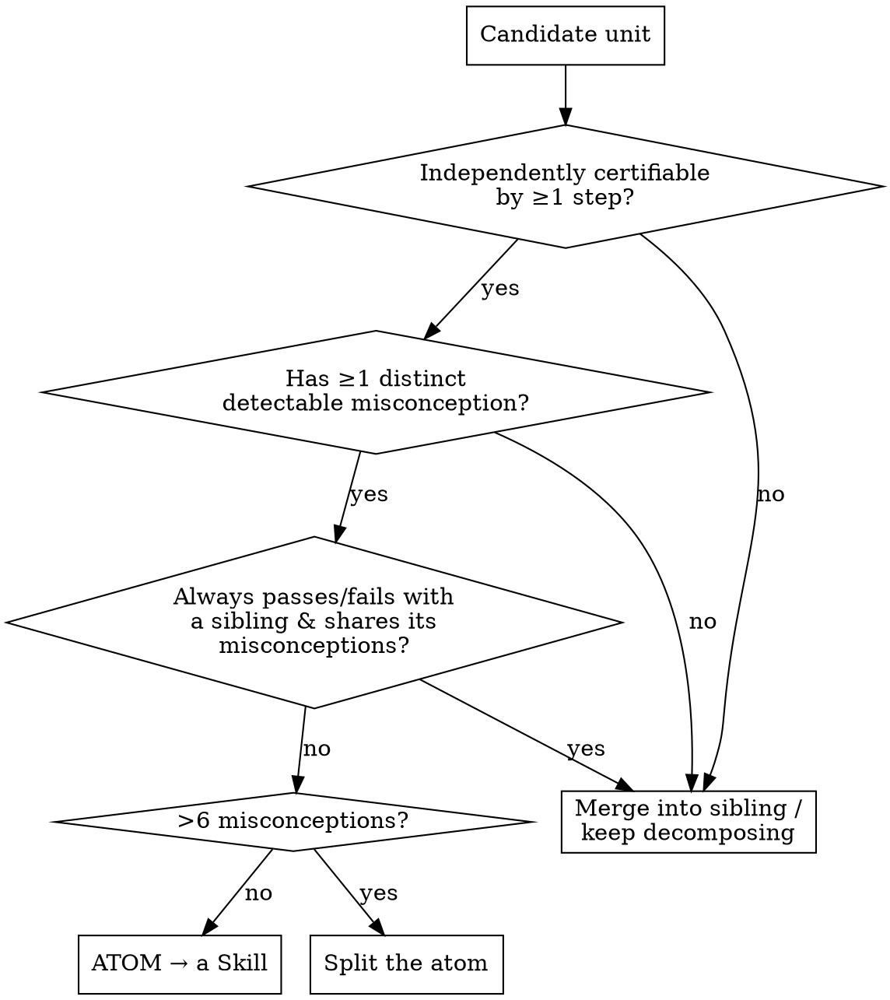

# Authoring Trellis Content

## Overview

Trellis content is **discovered, not invented**. A learner's pathway is latent in the structure of
the knowledge itself; your job is to find it by **descending** from a goal to atomic skills, then
**ascending** from atoms back into a goal-directed lesson — holding the **expert's map** and the
**learner's experience** in view at once.

This skill walks you through 8 ordered phases (P0–P7) that emit content conforming to the Trellis
schema (`TECHNICAL_DESIGN.md` §3) and passing the §13.2 CI gates. **Do the phases in order.** The
descent (P0–P3) is the expert's analysis; the ascent (P4–P6) is the learner's synthesis; P7
reconciles them.

**Reference files (read the one the current phase points to — do not inline the whole design):**
- `reference/schema-cheatsheet.md` — the §3 types, condensed.
- `reference/step-ladder.md` — the watch→predict→recognize→recall→build patterns.
- `reference/misconception-patterns.md` — vetted signature recipes + the fixture shape.
- `reference/verification-gates.md` — the §13.2 gates as a self-run checklist.
- `templates/node.yaml`, `templates/skill.taxonomy.yaml` — skeletons to fill.

## The Iron Rule

**No artifact before its phase.** Do not write a `node`, `cell`, `step`, or evaluator until you have
completed the descent (P0–P3) and produced the atom list + the DAG. The most common failure
(observed in baseline testing) is jumping straight to authoring a node — which produces an isolated
lesson whose `requires` point at skills that **do not exist**, a dangling reference that fails the
referential-integrity gate (§13.2.2).

**Violating the letter of the phases is violating the spirit.** "I'll just sketch the node first"
means you skipped the descent. Start at P0.

## The two axes of descent

When you decompose, you move along **both** axes at once:

- **Abstraction axis** — refine the topic into sub-topics: `Python → conditionals → if/else → the colon+indent block`.
- **Composition axis** — for a *goal*, ask "what must the learner simultaneously wield to achieve this?": `print "age: 7" from a variable → {string literal, variable use, str/number coercion, print}`.

You stop descending at an **atom** (see the stop-condition below).

## The phases

### Descent — the expert's map ("unpiece")

**P0 · Frame the goal.** Write one sentence: the target capability in *learner-observable* terms
("the learner can write a function that returns 'pass' when a score is ≥60"). Name the altitude
(domain → topic). This sentence is what the final `build` step must certify.

**P1 · Descend to atoms.** Decompose the goal along both axes (above) until every leaf is an atom by
the stop-condition. Probe fault-lines as you go (P2 is where they become real): *"where does a
competent-but-naive learner's model diverge here?"* — each divergence is a candidate atom boundary.
Output: a flat list of candidate atoms (→ `Skill` ids).

**P2 · Fault-lines → Misconceptions.** For each atom, enumerate the predictable failures. **Each
misconception MUST have a deterministically detectable signature** — `astTag`, `runError`,
`testFailure`, `choice`, or `recallEquals` (§7). If you cannot state how it is detected, it is not
yet a Trellis misconception: either find a detectable form or move it to a step kind where you
control the input space. **Critical gap:** a Python `SyntaxError` (e.g. `if x = 10:`) cannot be
AST-attributed — `ast.parse` throws before producing a tree, so there is no tag to match. Detect
such misconceptions at a `recognize`/`recall` step (distractor / `recallEquals`), not via build-step
AST. See `reference/misconception-patterns.md`. Atomicity recheck: 0 misconceptions → merge the atom
away; >6 → split it.

**P3 · Discover the DAG.** For every pair of atoms, draw a "needs-before" edge: A is required before
B iff B **cannot be demonstrated** without already wielding A. Classify each edge `kind`:
`prerequisite` (true dependency), `utility` (needed to express the answer but taught elsewhere), or
`track` (extension→spine-parent membership). **Referential-integrity check (do this now, not at
P7):** every skill you put in a node's `requires` MUST have a *producer* — a node in *this* content
set that `teaches` it. If a required skill has no producer, you have three honest choices: (a) author
the producing node too, (b) mark it out-of-scope and assume it is taught upstream **only if that
upstream node already exists in the bundle**, or (c) drop the requirement. Never reference a skill
that nothing teaches. The induced skill-dependency graph must be acyclic (§4.2).

### Ascent — the learner's pathway ("piece together")

**P4 · Atoms → ConceptNodes.** Group atoms into nodes (a node = the skills certified together as one
coherent capability). Set `track` (`spine` for the main line, `extension` for optional branches),
order by the DAG, and wire `requires` (with `kind`) and `teaches`. An `extension` node must `requires`
exactly one `kind: track` edge to its spine parent (§4.2).

**P5 · Nodes → Cells + the step ladder.** Per cell, sequence the ladder so the learner goes from
"lacks the atom" to "certified" — and *discovers the need* for each new idea before its mechanism:
- `watch` — install the idea plainly; set `carryContext` for what must survive into later steps.
- `predict` — provoke the misconception: make the learner commit a prediction, then run-and-reveal
  (the §11 high-value signal). Choose the snippet so the *wrong* prediction maps to a known
  misconception (`choice` distractors carry `misconception` ids).
- `recognize` / `recall` — low-stakes consolidation; this is where you detect misconceptions that a
  build step's AST cannot (syntax-shaped errors).
- `build` — certify by composing toward the goal. Author the `EvaluatorConfig` ladder
  (run→test→ast→property) with a reference-impl **oracle** so correct-but-unanticipated solutions
  pass. See `reference/step-ladder.md`.

**P6 · Feedback + hint ladders.** Per misconception: pre-authored `feedback` (selected, never
generated) + a 4-level `hintLadder` (1 nudge → 2 sharper → 3 worked → 4 solution with `revealCode`),
`skillDeltas`, and `upstream` for root-cause targeting.

### Reconcile

**P7 · Verify.** Self-run every gate in `reference/verification-gates.md`. The highest-value gate:
**every misconception ships `triggers:` and `notTriggers:` fixtures** that the real detector replays.
Then the pedagogical pass: every step rests only on satisfied prerequisites, and the final `build`
genuinely recomposes the P0 goal.

## Red flags — STOP and restart at P0

- Writing a `node`/`cell`/`step` before you have an atom list and a DAG.
- A `requires` skill id that nothing in the bundle `teaches` (dangling reference).
- A misconception with no detectable signature, or a syntax-error misconception attributed via AST.
- A misconception with no `triggers`/`notTriggers` fixture, or a fixture you wrote without tracing
  what it actually produces (a `notTriggers` sample that secretly fails a test case will fire).
- An atom with 0 misconceptions (merge it) or >6 (split it).
- A `build` step that doesn't recompose the stated P0 goal.

## Common mistakes

| Mistake | Fix |
|---|---|
| Jump straight to a node | Do P0–P3 first; the node falls out of the DAG |
| Dangling `requires` skill | P3 referential-integrity check: every required skill has a producer |
| Guessing AST query syntax | Use vetted recipes in `reference/misconception-patterns.md`; confirm with fixtures |
| SyntaxError → AST misconception | Detect it at `recognize`/`recall` instead |
| Inventing the fixture shape | Use the documented `triggers`/`notTriggers` shape in the patterns reference |
| Eyeballing fixtures | Trace/run each sample through the signature; a `notTriggers` that fails a test will fire |
| One atom, no misconception | Not a skill — merge it into a sibling |
| Property test omitted on build | Add a reference-impl oracle so novel-but-correct solutions pass |
